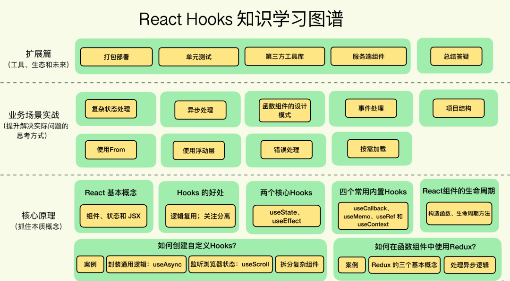
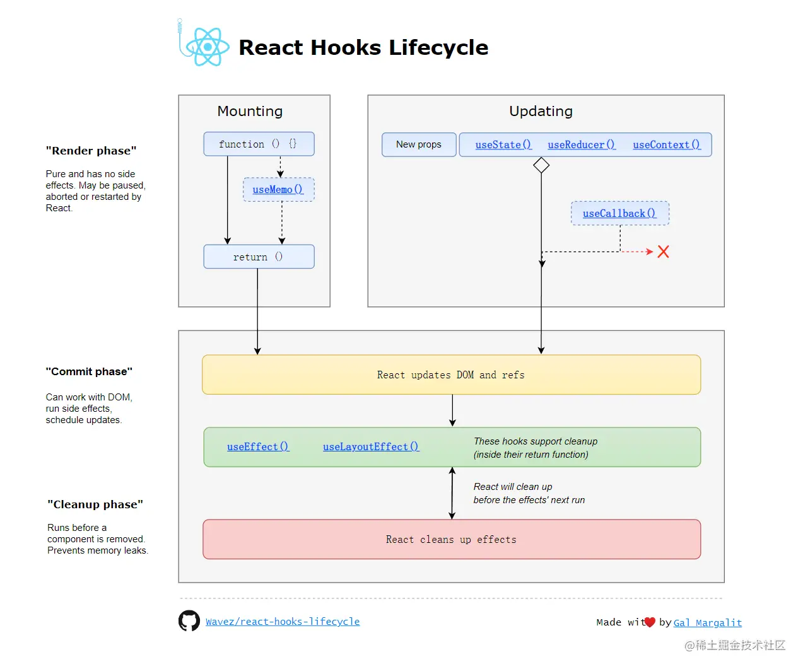
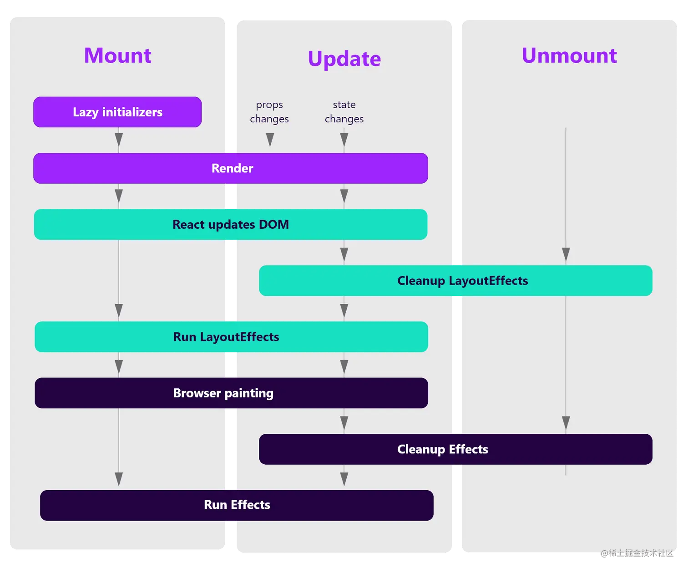

# React hooks 相关

## 为什么不能条件语句中，声明hooks? 并且需要在return语句之前声明?

React hooks: not magic, just arrays

这篇文章比较久远了, 大概是在hooks即将发布的那段日子里. 里面猜测了react hooks的实现方法, 他的推测是使用数组.会用两个数组存储 一个存state, 一个存setter, 并且按照顺序进行一一对应. 如果在条件语句中使用的话, 会造成你声明的hook值对应不上的问题. 二次渲染的时候就会报错了.

原理大概是这个意思.

这条理论从分析上来讲, 实现是有可能的. 但是react团队最终还是采取了由**fiber主导的性能优化方案链表**.

也就是说, **使用的是 .next 指向下一个hook, 如果在条件语句进行声明, 会导致mountHook的next和updateHook的next指向不一致**, 这样就会出错了.

## function函数组件中的 useState 和 class 类组件 setState有什么区别？

class组件, 它是一个实例. 实例化了以后, 内部会有它自己的状态. 而对于function来说, 它本身是一个方法, 是无状态的. 所以在class的state, 是可以保存的. 而function的state则依赖其它的方式保存它的状态, 比如hooks.

**相同点：**

- 首先从原理角度出发，setState和 useState 更新视图，底层都调用了 scheduleUpdateOnFiber 方法，而且事件驱动情况下都有批量更新规则。

**不同点：**

- 在不是 pureComponent 组件模式下， setState 不会浅比较两次 state 的值，只要调用 setState，在没有其他优化手段的前提下，就会执行更新。但是 useState 中的 dispatchAction 会默认比较两次 state 是否相同，然后决定是否更新组件。
- setState 有专门监听 state 变化的回调函数 callback，可以获取最新state；但是在函数组件中，只能通过 useEffect 来执行 state 变化引起的副作用。
- setState 在底层处理逻辑上主要是和老 state 进行合并处理，而 useState 更倾向于重新赋值。

## useEffect,useMemo 中，为什么useRef不需要依赖注入，就能访问到最新的改变值？

```js
function updateRef<T>(initialValue: T): {|current: T|} {
  const hook = updateWorkInProgressHook();
  return hook.memoizedState;
}
```

可以看到, 不论你的值如何更改, 你返回的内容都是 hook.memoizedState, 而它在内存当中都指向的是一个对象 `memoizedState` . 对象里的值不论怎么修改, 你都会直接拿到最新的值.

我们经常会在useEffect中调用 useState 返回数组的第二个元素 setter 的时候发现, 因为产生了闭包的关系, 里面的value永远不会更新. 这个时候我们就可以借助ref的方式进行处理了.

## useMemo是怎么对值做缓存的？如何应用它优化性能？

```js
function mountMemo<T>(  nextCreate: () => T,  deps: Array<mixed> | void | null,): T {  const hook = mountWorkInProgressHook();  const nextDeps = deps === undefined ? null : deps;  const nextValue = nextCreate();  hook.memoizedState = [nextValue, nextDeps];  return nextValue;}
```

其实我们这里就是记录了两个内容, 直接将当前的 依赖参数 deps记录了下来, 并且执行了 memo的第一个参数, 获取结果 存入 `nextValue=nextCreate()` 当中. 并且返回.

```js
function updateMemo<T>(  nextCreate: () => T,  deps: Array<mixed> | void | null,): T {  const hook = updateWorkInProgressHook();  const nextDeps = deps === undefined ? null : deps;  const prevState = hook.memoizedState;  if (prevState !== null) {    // Assume these are defined. If they're not, areHookInputsEqual will warn.    if (nextDeps !== null) {      const prevDeps: Array<mixed> | null = prevState[1];      if (areHookInputsEqual(nextDeps, prevDeps)) {        return prevState[0];      }    }  }  const nextValue = nextCreate();  hook.memoizedState = [nextValue, nextDeps];  return nextValue;}
```

在updateMemo里, 我们使用 `areHookInputsEqual(nextDeps,prevDeps)` 进行比较, 如果两次deps没有变动, 那么我们依旧返回刚才的数据. 这样就进行了一次性能优化了.

如果变动了, 就和mountMemo的操作一致.

这里的 `areHookInputsEqual` 方法, 也是 `useEffect` 等比较deps的方法.

里面利用的 `Object.is` 的方式进行比较, 这也解释了为什么只能进行浅diff操作.

## useEffect 返回的函数，什么时候执行？

```js
useEffect(()=>{
  // ...
  return destory;
},[a,b])
```

useEffect 的依赖数组，第二次变化时，执行上次的返回函数。而不是立即执行。

第二个参数作为依赖项，是一个数组，可以有多个依赖项，依赖项改变，执行上一次callback 返回的 destory ，和执行新的 effect 第一个参数 callback 。

常用hooks

- useState
- useEffect
- useCallback
- useReducer
- useRef
- useMemo
- useContext
- useLayoutEffect

其他hooks

- [`useImperativeHandle`](https://zh-hans.reactjs.org/docs/hooks-reference.html#useimperativehandle)
- [`useDebugValue`](https://zh-hans.reactjs.org/docs/hooks-reference.html#usedebugvalue)

## 学习图谱



### 生命周期





#### 挂载

正如上图中看到的，挂载阶段按照下面的顺序执行：

- 首先 react 运行 （惰性初始化程序）
- 第一次渲染
- React 更新 DOM
- 运行 LayoutEffects
- 浏览器绘制屏幕
- 运行 Effects

这里发生了什么？ 首先是惰性初始化器，然后 React 进行第一次渲染并更新 DOM，然后 React 运行 LayoutEffects。下一个活动是浏览器屏幕绘制，最后 React 运行 Effects。

#### 更新

在每次更新时，React都会从由 state 或 props 变化引起的重新渲染开始。现在就没有惰性的初始化调用了。

- render
- React 更新 DOM
- 清除 LayoutEffects
- 运行 LayoutEffects
- 浏览器绘制屏幕
- 清理 Effects
- 运行 Effects

注意，在渲染之后，React 清理了 LayoutEffects，使其紧接着运行。浏览器然后绘制屏幕，之后React清理 Effects 并紧接着运行它。

挂载和更新之间的主要区别是：

- 惰性初始化仅在挂载时
- 挂载阶段不存在清理工作

#### 卸载

在卸载期间，React 清理所有效果：

- 清理 LayoutEffects
- 清理 Effects

> 作者：_你当像鸟飞往你的山
> 链接：<https://juejin.cn/post/7218942994467389498>
> 来源：稀土掘金
