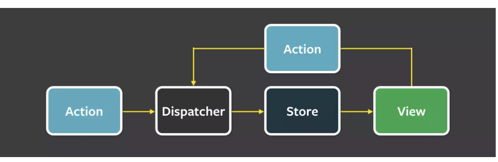

```
Redux` 是一种 `数据的管理` 方式，界面上发起各种操作 `Action` ，然后 `Dispatcher` 到 `Store`更新状态 `State`，推送新状态到视图 `View
```

- 编写 Action

- 编写 Reducers;事件对应的响应处理，处理完后返回新 `state`;使用 `combineReducers` 合并所有的处理过程

- 编写组件

  1. 使用 `connect` 连接组件

  2. 使用 `dispatch` 方法派发事件

- 定义

```
connect([mapStateToProps], [mapDispatchToProps], [mergeProps], [options])
复制代码
```

- 参数

| 名称               | 说明                                                         |
| ------------------ | ------------------------------------------------------------ |
| mapStateToProps    | `store` 绑定 `state` , 做更新的需要传入                      |
| mapDispatchToProps | 绑定派发事件 `event` , 不传的话默认 `dispatch` 对象, 就像上面的 `AddTodo` 组件 |
| mergeProps         | `[mergeProps(stateProps, dispatchProps, ownProps): props] (Function):` 合并属性自定义，自己不传的话默认 `·Object.assign` ，我也是放空默认的 |
| options            | 一些选项，我没怎么在意，知道有就行                           |

`[mapStateToProps], [mapDispatchToProps]` 这两个用到的多，大家自己练习下.

标准代码格式

1. `createStore(reducers)` 创建 `store`
2. `Provider` 适配器压入 `store` 对象, 子节点都受 `Redux` 控制