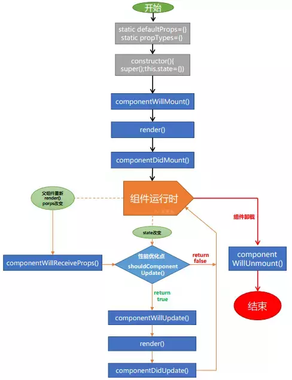

## 生命周期函数

### 装载组件触发

```
componentWillMount
```

只会在装载之前调用一次，在 `render` 之前调用，你可以在这个方法里面调用 `setState` 改变状态，并且不会导致额外调用一次 `render`

```
componentDidMount
```

只会在装载完成之后调用一次，在 `render` 之后调用，从这里开始可以通过`ReactDOM.findDOMNode(this)` 获取到组件的 DOM 节点。

### 更新组件触发

这些方法不会在首次 `render` 组件的周期调用

- `componentWillReceiveProps`
- `shouldComponentUpdate`
- `componentWillUpdate`
- `componentDidUpdate`

### 卸载组件触发

- `componentWillUnmount`



## 数据自顶向下流动

父组件或子组件都不能知道某个组件是有状态还是无状态，并且它们不应该关心某组件是被定义为一个函数还是一个类。

这就是为什么状态通常被称为局部或封装。 除了拥有并设置它的组件外，其它组件不可访问。

这通常被称为`自顶向下`或`单向`数据流。 任何状态始终由某些特定组件所有，并且从该状态导出的任何数据或 UI 只能影响树中`下方`的组件。

## 新的生命周期


