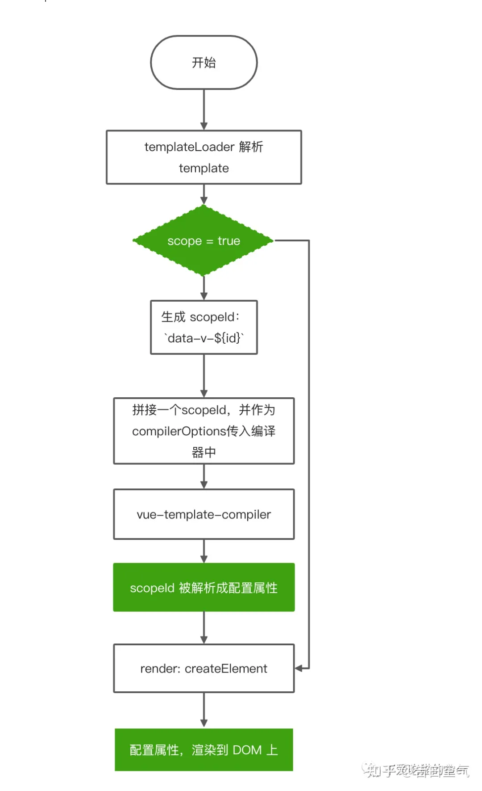

# 组件 scope 底层原理

当一个style标签拥有scoped属性时，它的CSS样式就只能作用于当前的组件。通过该属性，可以使得组件之间的样式不互相污染。如果一个项目中的所有style标签全部加上了scoped，相当于实现了样式的模块化。

## 作用

样式隔离，样式模块化。

## 原理

每个 Vue 文件都将对应一个唯一的 id，该 id 根据文件路径名和内容 hash 生成，通过组合形成scopeId。
编译 template 标签时，会为每个标签添加了当前组件的scopeId，如：

```html
<div class="demo">test</div>
// 会被编译成:
<div class="demo" data-v-12e4e11e>test</div>
```

编译 style 标签时，会根据当前组件的 scopeId 通过属性选择器和组合选择器输出样式，如:

```css
.demo{color: red;}
// 会被编译成:
.demo[data-v-12e4e11e]{color: red;}
```

这样就相当为我们配置的样式加上了一个唯一表示。



templateLoader，解决了 id 渲染 DOM 上面的问题，而 stylePostLoader 的作用就是在 Css 中添加属性选择器。

在stylePostLoader.js中生成一个 id ，同一个单页面组件中的 style，与 templateLoader 中的 scopeId 保持一致。

然后通过 PostCSS 解析 style 标签内容，同时通过 scopedPlugin 为每个选择器追加一个 [scopeId] 的属性选择器.

这里还会对 scoped 有一些特殊处理。对于 '>>>' 、 '/deep/'、::v-deep、pseudo等特殊选择器时，将不会将 [scopeId] 的属性选择器追加。

vue-loader 通过生成哈希 ID，根据 type 的不同调用不同的 loader（type = style, 执行 stylePostLoader;type = template , 执行 templateLoader） ，将哈希 ID 分别注入到 DOM 和属性选择器中。实现 CSS 局部作用域的效果。CSS Scoped 可以算作为 Vue 定制的一个处理原生 CSS 作用域的解决方案。

><https://zhuanlan.zhihu.com/p/394134606>
