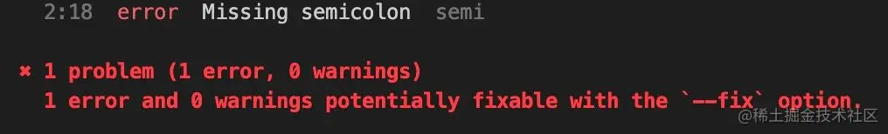

# Eslint 使用教程

Eslint 中文官网[https://zh-hans.eslint.org/docs/latest/use/getting-started]

ESLint 是一个根据方案识别并报告 ECMAScript/JavaScript 代码问题的工具，其目的是使代码风格更加一致并避免错误。

eslint 是可组装的 javascript 和 JSX 检查工具。就是说它可以帮我们检查我们的 javascript 代码，来保证代码的一致性和避免错误。当然，通过其他的解释器，它也能帮我们检查 typescript。可组装的意思是 eslint 是插件化的，每一个规则都是插件，我们可以根据自己的需要去组装出不同的规则集合满足自己项目的需求。

## 安装和初始化

### 先初始化一个空的工程

```sh
npm init
```

安装 eslint，你可以选择全局安装或者项目内安装，我这里选项目内安装

```sh
npm i -D eslint
```

### 初始化 eslint 配置

你可以通过`eslint --init`，以命令行工具的方式去生成一个 eslint 的配置文件，它会根据你选择的选项去帮你下载相应的包，生成相应的配置。

也不用命令行工具生成，直接在项目根目录下新建`.eslintrc.js`文件。需注意的是 eslint 支持多种格式的配置文件，优先级如下：

`.eslintrc.js > .eslintrc.yaml > .eslintrc.yml > .eslintrc.json > .eslintrc > package.json`

新建好的空配置文件内容如下：

```js
module.exports = {
  // 在这里写我们的配置
};
```

## 配置

经过上面的初始化步骤，我们现在可以开始写配置了
其实 eslint 的配置字段其实不算多，总结起来就几个 `root|parser|parserOptions|extends|plugins|rules|globals|env |overrides|settings` 等，我这里选常用的来讲，基本覆盖日常的工作需求了，更具体的可以直接去官网上查。

### root

首先给我们的配置增加 root: true 这个配置，这个配置是让 eslint 不要往父级去继续查找配置，让我们项目内需要被检测的文件都走我们的项目根目录下的这个配置。

### rules

我们可以先配置一条规则来尝试一下，假如我们想要代码结束的时候都要加分号，我们可以增加如下配置

```js
    rules: {
    // 这里的规则的值如果是字符串，则支持以下几个值
    // 'error'|2: 当你的语句没有分号结束时，则会报错提示，编译程序会退出
    // 'warn'|1: 当你的语句没有分号结束时，则会告警提示，不会导致程序退出
    // 'off'|0: 关闭这条规则
    semi: 'error',
    },
```

此时加入我们的源码目录下有一个 test.js，内容如下：

```js
// 这里没加分号
console.log("eslint");
```

此时控制台执行如下命令

`npx eslint ./src/test.js`

就会看到如下报错



假如你在命令的最后加上--fix 选项，且这是一条可以自动修复的规则，eslint 就会帮你自动修复，具体哪些规则支持自动修复可看官网上的带有设置小图标的规则。
上面说了规则 rules 的基本使用，规则的值其实不仅支持字符串，还支持数组，当规则的值是数组时，数组的第一个值是对规则的打开关闭，后面的值就是给这个规则的参数。当然，有些规则是没有参数可以配置的。具体的规则支持哪些参数可自行去官网查阅
举个例子：

```js
{
    rules: {
        // 如果只配置了字符串的值，如下
        // 当使用了console.log|error|warn等时，就会报错
        'no-console': 'error',
        // no-console这条规则是支持传参的，如果传的是如下参数
        // 当使用了console.log就不会报错，但error|warn就会
        'no-console': ['error', { allow: ['log']}],
    },
}
```

### extends

上面对规则 rules 的使用已经进行了详尽的介绍了，但是如果每个项目使用 eslint 的时候都要像上面一样一条条规则去配置的话，就非常麻烦了。此时我们可以使用 extends 字段，去继承使用别人写好的最佳实践。直白点讲就是把别人定义好的 rules 集合拿过来用。当然，我们也可以把我们自己写的 eslint 配置做成一个 npm 包给别人去 extend，具体如何去做这样一个包，我后面有空会单独开一篇文章（其实很简单，就是把你的 eslintrc.js 共享出去而已）
通常来讲 extends 可以分为以下几种：

eslint 开头的，就是 eslint 官方的扩展，如 eslint:recommended(推荐规范)和 eslint:all(所有规范)

eslint-config 开头的，比如第三方发布到 npm 上的，如 eslint-config-airbnb（airbnb 的规范），eslint-config-alloy（腾讯 Alloy team 的规范）等

plugin 开头的，就是通过插件共享的规则，如 eslint-plugin-vue，我们使用其中的 plugin:vue/vue3-recommended 的规则集

@开头的，跟 eslint-config 开头的类似，只不过是加了作用域，例如@vue/eslint-config-prettier 就是加了个作用域

举个实际的例子如下：

```js
{
    // extends可以是字符串，可以是数组，数组的时候就可以配置多个
    extends: [
        // eslint官方扩展，无需再安装npm包就可使用
        'eslint:recommended',
        // airbnb的扩展，需要先安装eslint-config-airbnb及其依赖才能使用，这种eslint-config-开头的可以省略前面的
        // 比如直接传'airbnb'即可
        'eslint-config-airbnb',
        // @开头的，就是加了作用域，跟上面的类似，使用前也需要先安装，也可以省略调eslin-config
        // 比如直接传'@vue/prettier'即可
        '@vue/eslint-config-prettier',
        // plugin开头的，使用前需先安装，通常一个插件会提供多套规则，而我们则通过plugin:pluginName/configName这样的形式在extends中引入插件提供的规则，如下面使用的eslint-plugin-vue就有recommended|vue3-recommended等多套规则
        'plugin:vue/vue3-recommended'
    ],
}
```

### parser 和 parserOptions

eslint 默认的解析器是 espree，只支持转换 js，默认支持到 ES5 的语法，假如需要支持更高版本的语法，则可以通过 parserOptions 来指定版本号

```js
{
    parserOptions: {
        // 指定支持es6的语法
        ecmaVersion: 6,
        // 默认是script，但我们现在都是模块，所以将它指定为module
        sourceType: 'module',
        ecmaFeatures: {
            // 启用jsx语法，如果不打开，当我们写jsx语法的时候，eslint就会校验不通过，因为它会认为<不是一个合法的token
            jsx: true,
        }
    }
}
```

默认的 espree 解释器和规则只支持最新的 ECMAScript 标准，对于一些还没成为标准的实验性语法是不支持的，此时就需要@babel/eslint-parser 这个解释器了。当然，使用这个解释器的前提是你的项目使用了 babel。当你使用了 babel 和这个解释器，babel 首先会将源码转换成 AST,然后这个解释器再将这个 AST 转换成 eslint 能动的 ESTree

假设你项目使用了 babel 的情况下，parser 的配置如下

```js
{
    // 使用前需先安装
    parser: '@babel/eslint-parser',
    parserOptions: {
        // @babel/eslint-parser相关的选项
    }
}
```

而假如你的项目使用了 typescript，你想用@typescript-eslint/eslint-plugin 这个插件提供的规则来校验你的代码，此时你就需要使用@typescript-eslint/parser 来做解释器了。
像以下配置即可对 ts 文件做校验了

```js
{
    // 使用前需先安装
    parser: '@typescript-eslint/parser',
    parserOptions: {
        // @typescript-eslint/parser的选项
    },
    // 使用前需先安装
    extends: ['plugin:@typescript-eslint/recommended']
}
```

而假设你的项目用的框架是 Vue，此时我们就会用 eslint-plugin-vue 提供的规则去检验我们的.vue 文件，这个插件需要依赖 vue-eslint-parser 作为解释器，而且这个解释器只会解析模板文件里面的 html 代码，script 标签里的代码则依然需要其他解释器处理，如果你的 script 标签里面是 ts，则可以用上面的@typescript-eslint/parser 作为解释器，如果 script 标签里面是 javascript，则可以用@babel/eslint-parser 作为解释器。
假设你的是 vue 项目，配置如下：

```js
{
    // 使用前需先安装
    parser: 'vue-eslint-parser',
    parserOptions: {
        // 因为eslint-vue-parser只处理模板里的html，所以它提供了一个选项parser给我们传进去解释器，去处理非html的代码
        parser: '@typescript-eslint/parser',
    },
    // 使用了vue-eslint-parser后，我们就可以用eslint-plugin-vue的规则去校验我们的代码了，使用前也需要先安装
    extends: ['plugin:vue/vue3-recommended'],
}
```

### plugins

上面对 parser 和 extends 做了详尽的介绍，而这里介绍一下上面提到的 plugins。插件其中一个作用是可以共享配置，如上面介绍的配合 extends 来继承插件里面的规则，还有另一个最重要的作用是扩展 eslint 的规则，因为本身官方的规则只能检测 js 语法，如果是像 vue 这样的文件就无能为力了，此时就需要通过插件去完成了，比如上面也提到的 eslint-plugin-vue，就是用来校验 eslint 本来不支持的 vue 模板文件的。
而通常我们使用插件，有两种用法，一种是像上面介绍的，通过 extends 去继承插件提供出来的规则集合。当然，前提是这个插件本身有提供出来相应的 config。
我们可以先简单看一下一个 eslint 插件的基本框架是什么样的，如下所示

```js
// eslint插件的基本架子
module.exports = {
    rules: {
    // 规则一
    myCustomRule1: {
        create(context) {
            // 这里写你自定义的规则的具体实现
        }
    }
    // 规则二
    myCustomRule2: {
        create(context) {
            // 这里写你自定义的规则的具体实现
        }
    }
    // ...
    },
    configs: {
        // ...
        // 这里和extends相关
        // 模仿一下eslint-plugin-vue，我们这里也定义两套规则集，一套是vue2推荐使用的recommended，一套是vue3推荐使用的vue3-recommended
        recommonded: {
            plugins: ['eslint-plugin-myCustomPlugin'],
            rules: {
                'myCustomPlugin/myCustomRule1': 'error'
            },
        },
        'vue3-recommend': {
            plugins: ['eslint-plugin-myCustomPlugin'],
            rules: {
                'myCustomPlugin/myCustomRule2': 'error'
            },
        }
    }
}
```

那上面的 eslint 插件使用的时候就有两种用法了，一种是通过 plugins+rules 的方式只开启其中的部分规则，如下所示

```js
{
    // eslint-plugin-前缀可省略，使用前需先下载
    plugins: ['myCustomPlugin'],
    rules: {
        // 使用其中一个规则
        'myCustomPlugin/myCustomRule1': 'error'
    },
}
```

这里需要特别注意的是，使用 plugins 字段之后，只是引入了插件，并没有使用具体规则，此时的校验是没有效果的，需要在 rules 中明确地开启你需要使用的规则。

从上面的第一种使用方式可以看出，使用插件里的规则仍需要一条条规则去打开，如果这个插件有很多规则，则还是有点麻烦。所以很多插件都有一个 configs 的配置，里面提供出多种规则的集合，我们可以通过 extends 去使用它给我们提供的规则集合

第二种使用方式如下：

```js
{
    // 使用前需先下载，使用方式为plugin:pluginName/configName
    // 可以看出，此时使用的是插件里面的其中一个config，此时就无需一条条规则去开启了，因为插件里面已经帮我们做了
    extends: ['plugin:myCustomPlugin/vue3-recommended'],
}
```

### globals 和 env

通常我们在项目里面会使用很多全局变量，比如浏览器环境下的 windows，node 环境下的 global 等，通常一些规则集像 eslint:recommended 等，是会校验不过的，因为在它看来你是使用了未定义的变量，这个时候 globals 就派上用场了

```js
{
    globals: {
        // 在这里指定你想使用的全局变量
        wx: true,
        xxx: true,
    }
}
```

但是像浏览器环境或者 node 环境全局变量有很多，一个个指定又太麻烦了，此时就可以使用 env 去指定环境，这样我们就无需一个个指定这个环境下的全局变量了.

```js
{
    env: {
        es6: true,
        node: true,
        browser: true,
    }
}
```

具体支持的环境可自行查阅官网。

### overrides

假如说有一些特定的文件你想针对他们使用特定的配置，此时就可以使用 overrides 字段去进行配置
具体如下所示：

```js
{
    // 支持指定多个特殊配置
    overrides: [
        {
            // 针对myFiles1目录下的j|ts文件
            files: ['**/myFiles1/*.{j,t}s?(x)'],
            // 这里指定需要排除的文件
            excludedFiles: ['*.test.js'],
            // 后面的配置就跟上面的一样了，根据自己需要来
            extends: ['xxx'],
        },
        {
            // 针对myFiles2目录下的j|ts文件
            files: ['**/myFiles2/*.{j,t}s?(x)'],
            // 这里指定需要排除的文件
            excludedFiles: ['*.test.js'],
            // 后面的配置就跟上面的一样了，根据自己需要来
            rules: {
                xxx: 'error'
            },
        },
    ],
}
```

### settings

settings 选项里面设置的内容会被提供给每一个被执行的规则，所以如果你的规则里面想要获取一些公共配置，也可以在这里配置，具体如下:

```js
{
    settings: {
    "yourShareData": 'abc'
    }
}
```

> 链接：<https://juejin.cn/post/7129771851638636575>
