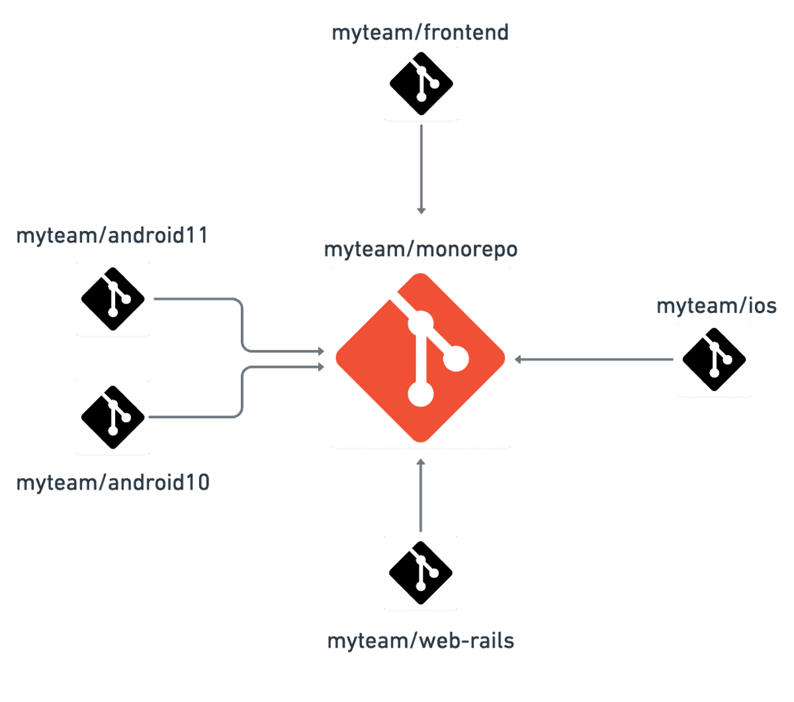

# Monorepo

> 原文地址：<https://xie.infoq.cn/article/4f870ba6a7c8e0fd825295c92>

由于谷歌在 Monorepo 上的实践，Monorepo 受到了越来越多的关注。Monorepo 意味着把所有项目的所有代码统一维护在一个单一的代码版本库中，和多代码库方案相比，两者各有优劣，需要根据公司文化和产品特性进行取舍。原文：What is monorepo? (and should you use it?)

Monorepos（单一代码库）有助于加快开发工作流程，在本文中，我们将帮助你认识这一代码组织模型是否适合你的团队和公司。

## 什么是 monorepo？

Monorepo 的意思是在版本控制系统的单个代码库里包含了许多项目的代码。这些项目虽然有可能是相关的，但通常在逻辑上是独立的，并由不同的团队维护。

有些公司将所有代码存储在一个代码库中，由所有人共享，因此 Monorepos 可以非常大。例如，理论上谷歌拥有有史以来最大的代码库，每天有成百上千次提交，整个代码库超过 80 TB。其他已知运营大型单一代码库的公司还有微软、Facebook 和 Twitter。

Monorepos 有时被称为单体代码库（monolithic repositories），但不应该与单体架构（monolithic architecture）相混淆，单体架构是一种用于编写自包含应用程序的软件开发实践。这方面的一个例子就是 Ruby on Rails，它可以处理 Web、API 和后端工作。

## 单一代码库（monorepos） vs 多代码库（multirepos）

与单一代码库相反的是多代码库（multirepos），每个项目都储存在一个完全独立的、版本控制的代码库中。多代码库是很自然的选择——我们大多数人在开始一个新项目时都愿意开一个新的代码库，毕竟，谁都喜欢从 0 开始.

从多代码库到单一代码库的变化就意味着将所有项目移到一个代码库中。



当然，这只是开始。当我们开始重构和整合时，困难的工作就来了。

```bash
mkdir monorepo
git init
mv ~/src/app-android10 ~/src/app-android11 ~/src/app-ios .
git add -A
git commit -m "My first monorepo"
```

多代码库不是微服务（microservices）的同义词，两者之间并没有耦合关系。事实上，我们稍后将讨论将单一代码库和微服务结合起来的例子。只要仔细设置用于部署的 CI/CD 流水线[2]，单一代码库就可以托管任意数量的微服务。

## 单一代码库的好处

乍一看，单一代码库和多代码库之间的选择似乎不是什么大问题，但这是一个会深刻影响到公司开发流程的决定。至于单一代码库的好处，可以列举如下：

- 可见性（Visibility）：每个人都可以看到其他人的代码，这样可以带来更好的协作和跨团队贡献——不同团队的开发人员都可以修复代码中的 bug，而你甚至都不知道这个 bug 的存在。
- 更简单的依赖关系管理（Simpler dependency management）：共享依赖关系很简单，因为所有模块都托管在同一个存储库中，因此都不需要包管理器。
- 唯一依赖源（Single source of truth）：每个依赖只有一个版本，意味着没有版本冲突，没有依赖地狱。
- 一致性（Consistency）：当你把所有代码库放在一个地方时，执行代码质量标准和统一的风格会更容易。
- 共享时间线（Shared timeline）：API 或共享库的变更会立即被暴露出来，迫使不同团队提前沟通合作，每个人都得努力跟上变化。
- 原子提交（Atomic commits）：原子提交使大规模重构更容易，开发人员可以在一次提交中更新多个包或项目。
- 隐式 CI（Implicit CI）：因为所有代码已经统一维护在一个地方，因此可以保证持续集成[3]。
- 统一的 CI/CD（Unified CI/CD）：可以为代码库中的每个项目使用相同的 CI/CD[4]部署流程。
- 统一的构建流程（Unified build process）：代码库中的每个应用程序可以共享一致的构建流程[5]。

## 单一代码库的缺陷

随着单一代码库的发展，我们在版本控制工具、构建系统和持续集成流水线方面达到了设计极限。这些问题可能会让一家公司走上多代码库的道路：

- 性能差（Bad performance）：单一代码库难以扩大规模，像 git blame 这样的命令可能会不合理的花费很长时间执行，IDE 也开始变得缓慢，生产力受到影响，对每个提交测试整个 repo 变得不可行。
- 破坏主线（Broken main/master）：主线损坏会影响到在单一代码库中工作的每个人，这既可以被看作是灾难，也可以看作是保证测试既可以保持简洁又可以跟上开发的好机会。
- 学习曲线（Learning curve）：如果代码库包含了许多紧密耦合的项目，那么新成员的学习曲线会更陡峭。
- 大量的数据（Large volumes of data）：单一代码库每天都要处理大量的数据和提交。
- 所有权（Ownership）：维护文件的所有权更有挑战性，因为像 Git 或 Mercurial 这样的系统没有内置的目录权限。
- Code reviews：通知可能会变得非常嘈杂。例如，GitHub 有有限的通知设置，不适合大量的 pull request 和 code review。

你可能已经注意到，这些问题中的大多数都和技术有关。在下面的章节中，我们将了解坚持使用单一代码库的公司是如何通过投资工具、添加集成以及编写定制解决方案来解决大部分问题的。

## 这不仅仅是技术问题

选择代码库策略不仅是一个技术问题，也是关于人们如何交流的问题。正如康威定律所言，沟通对于创造伟大的产品至关重要：

任何组织所设计的系统（此处的定义比信息系统宽泛得多）架构，都不可避免的反映为该组织沟通结构的副本。——康威定律

虽然多代码仓库允许每个团队独立管理他们的项目，但同时也阻碍了协作。它们就像眼罩一样，让开发人员只关注自己所拥有的部分，而忽略了整体。

另一方面，单一代码库就像一个枢纽、一个广场，每个开发人员、工程师、测试人员和业务分析师都可以在这里会面和交谈。单一代码库鼓励对话，帮助我们消除“竖井”。

## Monorepo 文化

Monorepos 已经存在很长时间了。三十年来，FreeBSD 一直使用 CVS 和后来的 subversion monorepos[6]进行开发和包分发。

许多开源项目已经成功使用了单一代码库。例如：

- Laravel[7]：一个用于 Web 开发的 PHP 框架。
- Symfony[8]：一个用 PHP 编写的 MVC 框架。有趣的是，他们已经为每个 Symfony 工具和库创建了只读存储库，这种方法被称为分库（split-repo）。
- NixOS[9]：一个用单一代码库发布包的 Linux 发行版
- Babel[10]：一个用户 Web 开发的流行的 JavaScript 编译器，其单一代码库包含了完整的项目及其所有插件。

此外，React[11]、Ember[12]和 Meteor[13]等前端框架都使用单一代码库。

然而，真正的问题是商业软件是否能从单一代码库中获益。考虑到这些优点和缺点，让我们来看一些已经尝试过的公司的经验。

## Segment，告别多代码库

Alex Noonan 讲述了一个关于告别多代码库的故事[14]。她所在的公司 Segment.com 提供活动收集和转发服务，每个客户都需要使用一种特殊格式的数据。因此，工程团队最初决定混合使用微服务和多代码库。

这一策略效果很好——随着客户基数的增长，他们扩大了规模，没有出现问题。但是，当转发目的地的数量超过 100 个时，事情开始变得糟糕起来。维护、测试和部署超过 140 个代码库（每个代码库都有数百个日益分化的依赖关系）的管理负担太高了。

> “最终，团队发现他们无法取得进展，三个全职工程师花费了大部分时间来维持系统的运行。”

对于 Segment 来说，补救办法就是合并，将所有的服务和依赖迁移到一个单一代码库中。他们必须协调共享库并且测试所有内容，虽然花了很大的代价，但迁移非常成功，最终的结果是降低了复杂性，增加了可维护性。

> “更快的速度就是证据。[…] 我们在过去 6 个月里对库的改进比 2016 年全年都要多。”

多年后，当一个小组询问她在微服务方面的经验时[15]，Alex 解释了她迁移到单一代码库的原因：

> “这并没有像我们想象的那样成为我们的优势。我们改变的主要动机是因为失败的测试会影响到不同的东西。 [..] 把它们分成单独的代码库只会让情况变得更糟，因为有可能你会过了 6 个月才集成某个库的更新，结果测试完全被破坏了，而你又不想花时间去修复。我见过的成功分解为独立代码库而不是服务的案例之一是，当我们有一块代码在多个服务之间共享时，我们想让它成为一个共享库。除此之外，我们发现，即使转向微服务，我们仍然更喜欢单一代码库。”

## Airbnb 和 monorail

Airbnb 的基础设施工程师延斯·范德海格（Jens Vanderhaeghe）也讲述了微服务和单一代码库是如何帮助他们向全球扩张的[16]。

Airbnb 最初的版本被称为“monorail”，是一个独立的 Ruby on Rails 应用程序。当公司开始指数级增长时，代码库也随之增长。当时，Airbnb 实施了一项名为“民主发布（democratic releases）”的新发布政策，意味着任何开发者都可以在任何时候发布产品。

随着 Airbnb 的扩张，民主程序的限制也受到了考验，合并更改变得越来越困难。Jens 的团队实施了一些缓解措施，比如合并队列和增强监控。这在一段时间内有帮助，但从长远来看还是不够。

Airbnb 的工程师们为维持 monorail 系统进行了英勇的斗争，但最终，经过数周的辩论，他们决定将该应用分割为多个微服务。因此，他们创建了两个单一代码库：一个用于前端，一个用于后端。两者都包含数百个服务、文档、用于部署的 Terraform 和 Kubernetes 资源以及所有维护工具。

当被问及单一代码库的优势时，Jens 说道：

> “我们不想处理所有这些微服务之间的版本依赖关系。[使用单一代码库]你可以通过一个提交在两个微服务之间做出改变。[..] 我们可以围绕一个代码库构建所有工具。最大的卖点是你可以同时在多个微服务上做出改变。我们通过脚本检测单一代码库中的哪些应用程序会受到影响，然后部署这些应用程序。我们获得的主要好处是源代码控制。”

## Uber，来来回回

来自优步（Uber）的艾米•卢西多（Aimee Lucido）描述了从单一代码库到多代码库再切换回来的过程[17]。

当时，她正在 Android 客户团队工作。他们从一开始就使用单一代码库，但是经过 5 年的快速发展，单一代码库的问题开始显现出来。

> “我们开始遭遇可怕的 IDE 死锁，我们甚至不能在 Android Studio 中翻看代码，否则 IDE 就会没有任何反应。”

问题并不只是发生在 IDE，也影响到 Git，构建过程一拖再拖。更糟糕的是，他们经常会破坏主线，这让他们无法构建任何东西。

> “公司规模越大，就越频繁地遇到主线被破坏的情况。”

当 Uber 达到中等规模时，团队决定切换到多代码库，这解决了很多问题。Uber 的工程师们喜欢这样的状态：他们可以拥有一部分代码，并且只对这部分代码负责。

> “如果你只构建地图应用，那么你可以很快构建出来，这太棒了。”

但故事并没有到此结束。又过了一段时间，多代码库策略开始显示出它的弱点。这一次不仅仅是关于技术问题，而是关于人们如何合作。团队被分解成多个竖井，管理数千个代码库的开销消耗了大量宝贵的时间。

每个团队都有自己的编码风格、框架和测试实践。管理依赖关系也变得更加困难，依赖关系的恶魔抬起了它丑陋的头，这使得最终将所有内容整合到一个产品中变得非常困难。

就在这个时候，Uber 的工程师们再次合作，决定再给单一代码库一次机会。有了更多的资源并且提前知道他们将面临的问题，他们选择投资于工具：他们修改了 IDE，实现了合并队列，并使用增量构建来加快部署。

> “当你发展到一个大公司的规模时，可以投入资源，让你的大公司感觉像一个小公司，把缺点变成优点。”

## Pinterest，全力投资单一代码库

让我们以一家正在经历三年转型的公司作为总结：Pinterest。他们的努力包括了两个方面。首先，将 1300 多个代码库切换到四个单一代码库中。其次，将数百个依赖项整合到一个完整的 Web 应用程序中。

他们为什么要这么做？Eden JnBaptiste[18]解释说，多代码库使得他们很难重用代码。情况是一样的：代码太过分散，每个团队都有自己的仓库，有自己的风格和结构。构建过程质量标准是高度可变的，构建和部署变得非常困难。

Pinterest 发现，基于主干开发[19]配合单一代码库有助于取得进展。基于主干的开发的基础是只使用临时分支，尽可能频繁的合并到主分支上，从而减少合并冲突的机会。

> “将所有代码放在一个仓库中有助于我们减少（构建系统中的）反馈循环。”

对于 Pinterest，单一代码库提供了一致的开发工作流。发布实践的自动化、简化和标准化允许他们减少文档，让开发人员专注于编写代码。

## 投资于工具

如果我们必须从所有这些故事中吸取一个教训，那就是正确的工具是有效的单一代码库的关键——需要重写思考构建和测试。我们可以使用智能构建系统，而不是在每次更新时重新构建完整的仓库，它需要了解项目结构，并且只对自上次提交以来变更的部分进行操作。

我们大多数人都没有谷歌或 Facebook 的资源。那我们能做什么呢？幸运的是，许多大公司的构建系统都是开源的：

Bazel[20]：由谷歌发布，部分基于他们自己的构建系统（Blaze）。Bazel 支持多种语言，并支持大规模构建和测试。

- Buck[21]: Facebook 开源的快速构建系统，支持在多种语言和平台上进行不同的构建。
- Pands[22]：Pands 构建系统是与 Twitter、Foursquare 和 Square 合作创建的。目前只支持 Python，后续还将支持更多的语言。
- RushJS[23]：微软用于 JavaScript 的可扩展的单一代码库管理器，能够从一个代码库构建和部署多个包。

Monorepos 正在获得越来越多的关注，尤其是在 JavaScript 方面，如下项目所示：

- Lerna[24]：JavaScript 的单一代码库管理器，可以与 React、Angular 或 Babel 等流行框架集成。
- Yarn workspace[25]：用一个命令在多个地方安装和更新 Node.js 的依赖项。
- ultra-runner[26]：JavaScript 单一代码库管理脚本，支持 Yarn、pnpm 和 Lerna 插件，支持并行构建。
- Monorepo builder[27]：通过单一代码库安装和更新 PHP 包。

## 扩展代码库

源代码控制是单一代码库的另一个痛点，这些工具可以帮助您扩展存储库：

- Virtual Filesystem for Git（VFS）[28]：为 Git 添加流支持。VFS 可以根据需要从 Git 仓库下载对象。这个项目最初是为了管理 Windows 代码库（最大的 Git 仓库）而创建的，只能在 Windows 上使用，但已经宣布要支持 MacOS。
- Large File Storage[29]：Git 的开源扩展，为大文件提供了更好的支持。安装了这个扩展，就可以跟踪任何类型的文件，并将它们无缝的上传到云存储中，从而释放代码库的空间，使 push 和 pull 的速度更快。
- Mercurial[30]：Git 的替代方案，Mercurial 是一个分布式版本控制工具，专注于速度。Facebook 使用 Mercurial，多年来已经发布了许多提高速度的补丁[31]。
- Git CODEOWNERS[32]：允许定义哪个团队拥有代码库中的子目录，当有人提交 pull request 或 push 代码到受保护的分支时，代码所有者会自动被要求进行审查。GitHub 和 GitLab 都支持这一特性。

## Monorepo 管理最佳实践

基于这些单一代码库的故事，我们可以定义一套最佳实践：

定义一个便于探索的统一的目录组织。

维护分支整洁，保持较小的分支，考虑采用基于主干的开发。

为每个项目使用固定的依赖项，一次升级所有依赖项，迫使每个项目都跟上依赖项。只为真正的例外情况保留例外。

如果正在使用 Git，学习如何使用 shallow clone[33]和 filter-branch[34]来处理大容量代码库。

货比三家，寻找像 Bazel 或 Buck 这样的智能构建系统，以加速构建和测试。

如果需要限制对某些项目的访问，请使用 CODEOWERS。

使用 Semaphore[35]等 CI/CD 云平台来大规模测试和部署应用程序。

## 你应该使用单一代码库吗?

看情况而定，没有适合所有用例的答案，有些公司可能会暂时选择单一代码库，然后决定需要转向多代码库，或者相反，而其他人可能会选择混合代码库。当你有疑问的时候，考虑一下从单一代码库到多代码库通常比反过来要更容易。但千万不要忽视这一点，最终，这与技术无关，而是与工作文化和沟通有关。所以，根据你想要的工作方式来做决定。

> References:

[1] <https://semaphoreci.com/blog/what-is-monorepo>

[2] <https://semaphoreci.com/blog/cicd-pipeline>

[3] <https://semaphoreci.com/continuous-integration>

[4] <https://semaphoreci.com/cicd>

[5] <https://semaphoreci.com/blog/build-stage>

[6] <https://docs.freebsd.org/en_US.ISO8859-1/articles/committers-guide/article.html>

[7] <https://laravel.com/>

[8] <https://symfony.com/>

[9] <https://github.com/NixOS/nixpkgs/>

[10] <https://github.com/babel/babel/blob/master/doc/design/monorepo.md>

[11] <https://github.com/facebook/react/tree/master/packages>

[12] <https://github.com/emberjs/ember.js/tree/master/packages>

[13] <https://github.com/meteor/meteor/tree/devel/packages>

[14] <https://segment.com/blog/goodbye-microservices/>

[15] <https://www.infoq.com/articles/microservices-from-trenches-lessons-challenges/>

[16] <https://www.youtube.com/watch?v=sakGeE4xVZs>

[17] <https://www.youtube.com/watch?v=lV8-1S28ycM>

[18] <https://www.youtube.com/watch?v=r5KHQnS6uP8>

[19] <https://trunkbaseddevelopment.com/>

[20] <https://bazel.build/>

[21] <https://buck.build/>

[22] <http://www.pantsbuild.org/>

[23] <https://rushjs.io/>

[24] <https://github.com/lerna/lerna>

[25] <https://classic.yarnpkg.com/en/docs/workspaces/>

[26] <https://github.com/folke/ultra-runner>

[27] <https://github.com/Symplify/MonorepoBuilder>

[28] <https://vfsforgit.org/>

[29] <https://git-lfs.github.com/>

[30] <https://www.mercurial-scm.org/>

[31] <https://engineering.fb.com/2014/01/07/core-data/scaling-mercurial-at-facebook/>

[32] <https://help.github.com/articles/about-codeowners/>

[33] <https://github.blog/2020-12-21-get-up-to-speed-with-partial-clone-and-shallow-clone/>

[34] <https://git-scm.com/docs/git-filter-branch>

[35] <https://semaphoreci.c>
