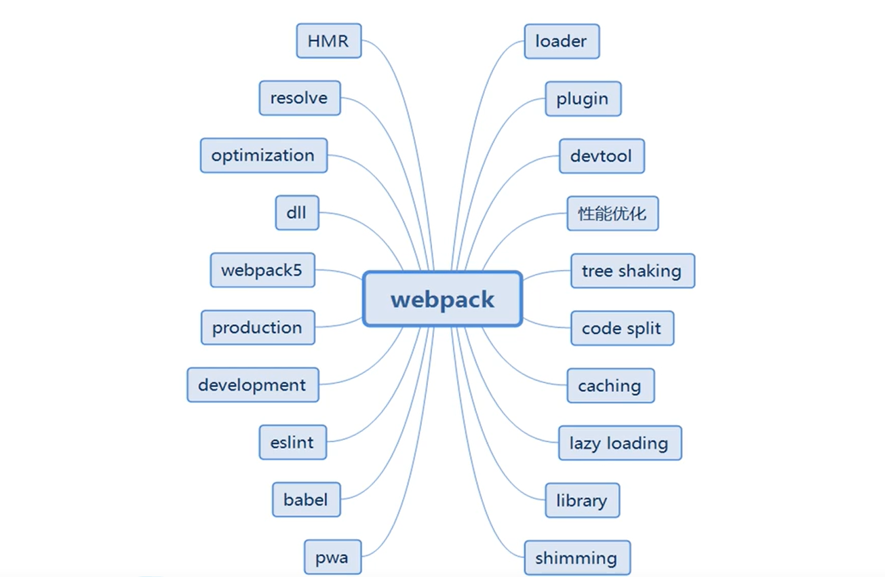

# webpack 相关



## Webpack面试问题

### 1、webpack打包原理

把所有依赖打包成一个 bundle.js 文件，通过代码分割成单元片段并按需加载。

### 2、webpack的优势

（1） webpack 是以 commonJS 的形式来书写脚本滴，但对 AMD/CMD 的支持也很全面，方便旧项目进行代码迁移。
（2）能被模块化的不仅仅是 JS 了。
（3） 开发便捷，能替代部分 grunt/gulp 的工作，比如打包、压缩混淆、图片转base64等。
（4）扩展性强，插件机制完善

### 3、什么是loader，什么是plugin

loader用于加载某些资源文件。因为webpack本身只能打包common.js规范的js文件，对于其他资源如css，img等，是没有办法加载的，这时就需要对应的loader将资源转化，从而进行加载。

plugin用于扩展webpack的功能。不同于loader，plugin的功能更加丰富，比如压缩打包，优化，不只局限于资源的加载。

### 4、什么是bundle，什么是chunk，什么是module

**bundle：** 是由webpack打包出来的文件
**chunk：** 是指webpack在进行模块依赖分析的时候，代码分割出来的代码块
**module：** 是开发中的单个模块

### 5、webpack 和 gulp 的区别？

**webpack：**
webpack是一个模块打包器，强调的是一个前端模块化方案，更侧重模块打包，我们可以把开发中的所有资源都看成是模块，通过loader和plugin对资源进行处理。
**gulp：**
gulp是一个前端自动化构建工具，强调的是前端开发的工作流程，可以通过配置一系列的task，第一task处理的事情（如代码压缩，合并，编译以及浏览器实时更新等）。然后定义这些执行顺序，来让glup执行这些task，从而构建项目的整个开发流程。自动化构建工具并不能把所有的模块打包到一起，也不能构建不同模块之间的依赖关系。

### 6、什么是模热更新？有什么优点？

模块热更新是webpack的一个功能，它可以使得代码修改之后，不用刷新浏览器就可以更新。在应用过程中替换添加删出模块，无需重新加载整个页面，是高级版的自动刷新浏览器。
**优点：**
只更新变更内容，以节省宝贵的开发时间。调整样式更加快速，几乎相当于在浏览器中更改样式

### 7、webpack-dev-server 和 http服务器的区别

webpack-dev-server使用内存来存储webpack开发环境下的打包文件，并且可以使用模块热更新，比传统的http服务对开发更加有效。

### 8、什么是长缓存？在webpack中如何做到长缓存优化？

浏览器在用户访问页面的时候，为了加快加载速度，会对用户访问的静态资源进行存储，但是每一次代码升级或者更新，都需要浏览器去下载新的代码，最方便和最简单的更新方式就是引入新的文件名称。

在webpack中，可以在output给出输出的文件制定chunkhash，并且分离经常更新的代码和框架代码，通过NameModulesPlugin或者HashedModulesPlugin使再次打包文件名不变。

### 9、什么是Tree-sharking?CSS可以Tree-shaking吗?

Tree-shaking是指在打包中去除那些引入了，但是在代码中没有被用到的那些死代码。在webpack中Tree-shaking是通过uglifySPlugin来Tree-shakingJS。Css需要使用Purify-CSS。

### 10、如何可以自动生成webpack配置？

webpack-cli /vue-cli /etc …脚手架工具

### 11、webpack打包

在生产环境中，webpack执行的时候build.js文件太大，每次请求都会消耗很大的流量，如果修改代码，代码不会更新，浏览器记录了缓存，如果同名文件不会发起请求，走缓存；

使用readfileSync读取package.json文件中的版本号，把获取的version（版本号）加入到output出口文件build.js中，以版本号管理升级的问题，版本一升级所有的资源，都直接重新来，浪费很多不必要的流量，如果文件发生改变那么从新请求index.html内的引用也要发生改变；

以chunkhash来解决缓存后修改代码的问题，在每个文件的处理中都可以获取其数字签名，文件内容发生改变，chunkhash也发生改变，index,html中的chunkhash文件名也发生改名，产生系统升级，不走缓存；

如果更改css或者js或者第三方包,都会触发重新牺牲流量去请求新的build.js，使用webpack的插件extract-text-webpack-plugin，在插件中通过contenthash将css分离，css的更改和js的更改互不影响，只要发生改动就能绕过缓存完成升级；

如果修改js，会影响所有的js（里面的内容包括自己写的和第三方包），使用webpack插件CommonsChunkPlugin分离第三方库，把自己的js和第三方包分离，各走各的，第三方包走vendor；

改动main.js代码会导致重新生成vendor,使用manifest记录到依赖清单，每次只要改动vorder或者main都会重新生成关联清单，vendor不会被main.js所影响，main.js也不会被vendor所影响;

假如不走缓存的话，那么vendor和main的文件还是特别大，使用webpack插件uglifyjs-webpack-plugin，来压缩js，因为用了ES6，所以使用yarn下载，压缩之后js文件就小了差不多50%;

当前效果比之前好了很多，但是还不是最完美的，在没有任何缓存的情况下，用户一进来主页访问消耗的流量还是很大，此时就需要用到按需加载组件，webpack分块打包，在路由router中提供了一个功能，懒加载，不要需要改变任何路由配置，把所有独自默认一开始就加载的组件分块打包（除了全局下的），形成一个个封装的函数，在路由匹配需要渲染的时候才获取组件对象，在页面创建script标签请求回来，引入执行…

### 12、install

webpack是我们需要的模块打包机，webpack-dev-server用来创建本地服务器，监听你的代码修改，并自动刷新修改后的结果。这些是有关devServer的配置

```js
contentBase,  // 为文件提供本地服务器
port, // 监听端口，默认8080
inline, // 设置为true,源文件发生改变自动刷新页面
historyApiFallback  // 依赖HTML5 history API,如果设置为true,所有的页面跳转指向index.html
devServer:{
    contentBase: './src' // 本地服务器所加载的页面所在的目录
    historyApiFallback: true, // 不跳转
    inline: true // 实时刷新
}
 //然后我们在根目录下创建一个'webpack.config.js'，在'package.json'添加两个命令用于本地开发和生产发布
"scripts": {
            "start": "webpack-dev-server",
            "build": "webpack"
        }

123456789101112131415
```

### 12、entry

**entry:** 用来写入口文件，它将是整个依赖关系的根

```js
var baseConfig = {
        entry: './src/index.js'
    }
123
```

当我们需要多个入口文件的时候，可以把entry写成一个对象

```js
var baseConfig = {
        entry: {
            main: './src/index.js'
        }
    }
12345
```

建议使用后面一种方法，因为他的规模会随你的项目增大而变得繁琐

### 13、output

**output:** 即使入口文件有多个，但是只有一个输出配置

```js
var path = require('path')
    var baseConfig = {
        entry: {
            main: './src/index.js'
        },
        output: {
            filename: 'main.js',
            path: path.resolve('./build')
        }
    }
    module.exports = baseConfig
1234567891011
```

如果你定义的入口文件有多个，那么我们需要使用占位符来确保输出文件的唯一性

```js
output: {
        filename: '[name].js',
        path: path.resolve('./build')
    }
1234
```

如今这么少的配置，就能够让你运行一个服务器并在本地使用命令npm start或者npm run build来打包我们的代码进行发布

### 14、Loader

**loader的作用：**
1、实现对不同格式的文件的处理，比如说将scss转换为css，或者typescript转化为js
2、转换这些文件，从而使其能够被添加到依赖图中
loader是webpack最重要的部分之一，通过使用不同的Loader，我们能够调用外部的脚本或者工具，实现对不同格式文件的处理，loader需要在webpack.config.js里边单独用module进行配置，配置如下：

```js
 // test: 匹配所处理文件的扩展名的正则表达式（必须）
    // loader: loader的名称（必须）
    // include/exclude: 手动添加处理的文件，屏蔽不需要处理的文件（可选）
    //  query: 为loaders提供额外的设置选项
    // ex:
        var baseConfig = {
            // ...
            module: {
                rules: [
                    {
                        test: /*匹配文件后缀名的正则*/,
                        use: [
                            loader: /*loader名字*/,
                            query: /*额外配置*/
                        ]
                    }
                ]
            }
        }
12345678910111213141516171819
```

要是loader工作，我们需要一个正则表达式来标识我们要修改的文件，然后有一个数组表示
我们表示我们即将使用的Loader,当然我们需要的loader需要通过npm 进行安装。例如我们需要解析less的文件，那么webpack.config.js的配置如下：

```js
var baseConfig = {
                entry: {
                    main: './src/index.js'
                },
                output: {
                    filename: '[name].js',
                    path: path.resolve('./build')
                },
                devServer: {
                    contentBase: './src',
                    historyApiFallBack: true,
                    inline: true
                },
                module: {
                    rules: [
                        {
                            test: /\.less$/,
                            use: [
                                {loader: 'style-loader'},
                                {loader: 'css-loader'},
                                {loader: 'less-loader'}
                            ],
                            exclude: /node_modules/
                        }
                    ]
                }
            }
123456789101112131415161718192021222324252627
```

这里介绍几个常用的loader：
babel-loader： 让下一代的js文件转换成现代浏览器能够支持的JS文件。
babel有些复杂，所以大多数都会新建一个.babelrc进行配置

css-loader,style-loader:两个建议配合使用，用来解析css文件，能够解释@import,url()如果需要解析less就在后面加一个less-loader

file-loader: 生成的文件名就是文件内容的MD5哈希值并会保留所引用资源的原始扩展名

url-loader: 功能类似 file-loader,但是文件大小低于指定的限制时，可以返回一个DataURL事实上.
在使用less,scss,stylus这些的时候，npm会提示差什么插件，差什么，安上就行了

### 15、Plugins

plugins和loader很容易搞混，都是外部引用有什么区别呢？ 事实上他们是两个完全不同的东西。这么说**loaders负责的是处理源文件的**如css、jsx，**一次处理一个文件**。**而plugins并不是直接操作单个文件，它直接对整个构建过程起作用**下面列举了一些我们常用的plugins和他的用法
**ExtractTextWebpackPlugin:** 它会将入口中引用css文件，都打包到独立的css文件中，而不是内嵌在js打包文件中。下面是他的应用

```js
var ExtractTextPlugin = require('extract-text-webpack-plugin')
        var lessRules = {
            use: [
                {loader: 'css-loader'},
                {loader: 'less-loader'}
            ]
        }

        var baseConfig = {
            // ...
            module: {
                rules: [
                    // ...
                    {test: /\.less$/, use: ExtractTextPlugin.extract(lessRules)}
                ]
            },
            plugins: [
                new ExtractTextPlugin('main.css')
            ]
        }

123456789101112131415161718192021
```

**HtmlWebpackPlugin:**
作用： 依据一个简单的index.html模版，生成一个自动引用你打包后的js文件的新index.html

```js
var HTMLWebpackPlugin = require('html-webpack-plugin')
            var baseConfig = {
                // ...
                plugins: [
                    new HTMLWebpackPlugin()
                ]
            }
1234567
```

HotModuleReplacementPlugin: 它允许你在修改组件代码时，自动刷新实时预览修改后的结果注意永远不要在生产环境中使用HMR。这儿说一下一般情况分为开发环境，测试环境，生产环境。
用法如 new webpack.HotModuleReplacementPlugin()
webapck.config.js的全部内容:

```js
const webpack = require("webpack")
        const HtmlWebpackPlugin = require("html-webpack-plugin")
        var ExtractTextPlugin = require('extract-text-webpack-plugin')
        var lessRules = {
            use: [
                {loader: 'css-loader'},
                {loader: 'less-loader'}
            ]
        }
        module.exports = {
            entry: {
                    main: './src/index.js'
                },
                output: {
                    filename: '[name].js',
                    path: path.resolve('./build')
                },
                devServer: {
                    contentBase: '/src',
                    historyApiFallback: true,
                    inline: true,
                    hot: true
                },
                module: {
                    rules: [
                        {test: /\.less$/, use: ExtractTextPlugin.extract(lessRules)}
                    ]
                },
                plugins: [
                new ExtractTextPlugin('main.css')
            ]
        }

123456789101112131415161718192021222324252627282930313233
```

### 15、 resolve

配置导入包的路径

```js
 resolve : {
        alias : { //alias别名 修改vue导入的路径
            "vue$" : "vue/dist/vue.js"
        }
    }
12345
```

### 16、产品阶段的构建

目前为止，在开发阶段的东西我们已经基本完成了。但是在产品阶段，还需要对资源进行别的
处理，例如压缩，优化，缓存，分离css和js。首先我们来定义产品环境

```js
var ENV = process.env.NODE_ENV
    var baseConfig = {
        // ...
        plugins: [
            new webpack.DefinePlugin({
                'process.env.NODE_ENV': JSON.stringify(ENV)
            })
        ]
    }
123456789
```

然后还需要修改我们的script命令

```js
"scripts": {
            "start": "NODE_ENV=development webpack-dev-server",
            "build": "NODE_ENV=production webpack"
        }
1234
```

process.env.NODE_ENV 将被一个字符串替代，它运行压缩器排除那些不可到达的开发代码分支。
当你引入那些不会进行生产的代码，下面这个代码将非常有用。

```js
if (process.env.NODE_ENV === 'development') {
            console.warn('这个警告会在生产阶段消失')
        }
123
```

### 17、优化插件

**下面介绍几个插件用来优化代码**
**OccurenceOrderPlugin:** 为组件分配ID,通过这个插件webpack可以分析和优先考虑使用最多 的模块，然后为他们分配最小的ID
**UglifyJsPlugin:** 压缩代码
下面是他们的使用方法

```js
var baseConfig = {
// ...
new webpack.optimize.OccurenceOrderPlugin()
new webpack.optimize.UglifyJsPlugin()
}
12345
```

然后在我们使用npm run build会发现代码是压缩的

### 18、对webpack的看法

1. webpack是一个模块打包工具，使用webpack管理你的模块依赖，并编译输出她们所需要的静态文件，它能够很好地管理、打包web开发中所用到的html、css、js及各种静态文件，让开发过程更加高效。
2. webpack的两大特色：代码分割和模块处理

### 19、热重启

1. 热重启原理：eventsource sse，一旦服务器资源有更新，能够及时通知到客户端，从而实时的反馈到用户界面上。本质上是一个http，通过response流实时推送服务器信息到客户端。链接断开后会持续出发重连。_webpack_hmr:每隔10s推送一条在消息到浏览器
2. 实现：
   client：创建new EventSource （“／message”），
   Server：需要返回类型为text／event-stream的响应头，发送数据以data开头，\n\n结尾；
   webpack-dev-server是一个机遇express的web server，监听8080，server内部调用webpack，这样的好处是提供了热加载和热替换的功能；
   webpack-hot-middleware和webpack-dev-middleware
3. EventSource和websocket的区别：
   1. eventSource本质仍然是http，仅提供服务器端到浏览器端的单向文本传输，不需要心跳链接，链接断开回持续重发链接；
   2. websocket是基于TCP的协议，提供双向数据传输，支持二进制，需要心跳链接，断开链接不会重链；
   3. EventSource更简洁轻量，WebSocket支持行更好（IE10+）。后者功能更强大一点。

### 20、特性

所有的资源都可以当作一个模块来处理，热替换（不用刷新整个页面），代码拆分和按需加载，拥有灵活的可扩展plugin库和loader模块加载器；

### 21、如何使用常用插件？

1. HtmlWebpackPlugin的用法及多入口文件配置：作用是依据一个html模版，生成html文件，并将打包后的资源文件自动引入（title：；template：’‘，fileName：‘’，inject：js插入位置等）；
2. webpack.optimize.commonsChunkPlugin:抽取公共模块,减小打包体积，例如：vue的源码、jquery的源码等：entry：vendor：[‘react’];plugin:new web pack.optimize.CommonsChunkPlugin({name:’vendor’})
3. loader：
   \1. css：解析css代码，在js中通过require方式引入css文件
   \2. style：通过style的方式引入 {test:/.css$/,loader:’style-loader!css-loader’}，二者组合能将css代码写入到js文件中
4. 将样式抽取成单独的文件，extract-text-webpack-plugin（filename：‘’）：
5. url-loader：实现图片文字等的打包，有一个option选项limit属性表示，少于这个限制，则打包成base64，大于的话，就使用file-loader去打包成图片；
6. postcss：实现浏览器兼容，autoprefixer
7. babel：转es
8. hot module replacement：修改代码后，自动刷新实时预览修改后的效果。devServer：{hot:true,inline:true(实时刷新)}
9. ugliifyJsPlugin：压缩js代码

### 22、与gulp的比较

1. gulp是工具链，可以配合各种插件做js、css压缩，less编译等；而webpack能把项目中的各种js、css文件等打包合并成一个或者多个文件，主要用于模块化方案，
2. 侧重点不同，gulp侧重于整个过程的控制管理（像是流水线），通过配置不同的task，构建整个前端开发流程；webpack则侧重于模块打包；并且gulp的打包功能是通过安装gulp-webpack来实现的
3. webpack能够按照模块的依赖关系构建文件组织结构
