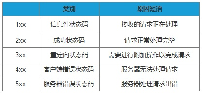
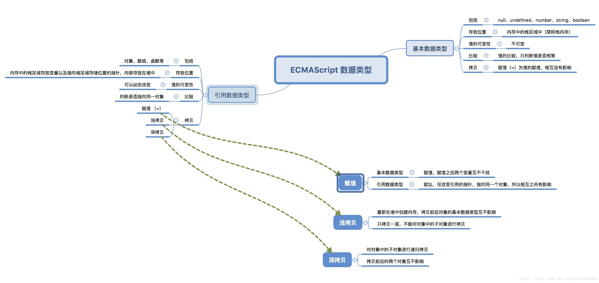

###XSS 攻击

   XSS（Cross Site Scripting），即跨站脚本攻击，是一种常见于web应用程序中的计算机安全漏洞.XSS通过在用户端注入恶意的可运行脚本，若服务器端对用户输入不进行处理，直接将用户输入输出到浏览器，然后浏览器将会执行用户注入的脚本

### http 状态码

301 Moved Permanently 被请求的资源已永久移动到新位置，并且将来任何对此资源的引用都应该使用本响应返回的若干个URI之一。如果可能，拥有链接编辑功能的客户端应当自动把请求的地址修改为从服务器反馈回来的地址。除非额外指定，否则这个响应也是可缓存的。

302 Found 请求的资源现在临时从不同的URI响应请求。由于这样的重定向是临时的，客户端应当继续向原有地址发送以后的请求。只有在Cache-Control或Expires中进行了指定的情况下，这个响应才是可缓存的。



### 闭包

闭包，官方对闭包的解释是：一个拥有许多变量和绑定了这些变量的环境的表达式（通常是一个函数），因而这些变量也是该表达式的一部分。闭包的特点：
  　　1. 作为一个函数变量的一个引用，当函数返回时，其处于激活状态。
  　　2. 一个闭包就是当一个函数返回时，一个没有释放资源的栈区。
      简单的说，Javascript允许使用内部函数---即函数定义和函数表达式位于另一个函数的函数体内。而且，这些内部函数可以访问它们所在的外部函数中声明的所有局部变量、参数和声明的其他内部函数。当其中一个这样的内部函数在包含它们的外部函数之外被调用时，就会形成闭包。

###Promise

###封装和继承

###浅拷贝和深拷贝，怎么实现深拷贝



### 解决跨域

(jsonp,cros；header设置参数)-跨域资源共享 cross-origin-resource-sharing

### TypeScript有哪些好处

TypeScript为JavaScript的超集（ECMAScript6）， 这个语言添加了基于类的面向对象编程。TypeScript作为JavaScript很大的一个语法糖，本质上是类似于css的less、sass，都是为了易于维护、开发，最后还是编译成JavaScript。

###css会阻塞页面渲染吗？会的话该怎么解决呢？怎么做到只加载首页的css？

1. css加载不会阻塞DOM树的解析
2. css加载会阻塞DOM树的渲染
3. css加载会阻塞后面js语句的执行

 CSS 是阻塞渲染的资源。需要将它尽早、尽快地下载到客户端，以便缩短首次渲染的时间。

通过使用媒体查询，我们可以根据特定用例（比如显示或打印），也可以根据动态情况（比如屏幕方向变化、尺寸调整事件等）定制外观。**声明您的样式表资产时，请密切注意媒体类型和查询，因为它们将严重影响关键渲染路径的性能。**

让我们考虑下面这些实例：

```html
<link href="style.css"    rel="stylesheet">
<link href="style.css"    rel="stylesheet" media="all">
<link href="portrait.css" rel="stylesheet" media="orientation:portrait">
<link href="print.css"    rel="stylesheet" media="print">
```

- 第一个声明阻塞渲染，适用于所有情况。
- 第二个声明同样阻塞渲染：“all”是默认类型，如果您不指定任何类型，则隐式设置为“all”。因此，第一个声明和第二个声明实际上是等效的。
- 第三个声明具有动态媒体查询，将在网页加载时计算。根据网页加载时设备的方向，portrait.css 可能阻塞渲染，也可能不阻塞渲染。
- 最后一个声明只在打印网页时应用，因此网页首次在浏览器中加载时，它不会阻塞渲染。
   最后，请注意“阻塞渲染”仅是指浏览器是否需要暂停网页的首次渲染，直至该资源准备就绪。无论哪一种情况，浏览器仍会下载 CSS 资产，只不过不阻塞渲染的资源优先级较低罢了。

### 面向对象三大要素 https://cherryblog.site/javascript-oop.html

面向对象有三大特性，封装、继承和多态。

### script 标签的 defer 和 async 标签的作用与区别

　script标签存在两个属性，defer和async，因此script标签的使用分为三种情况：

　　1.<script src="example.js"></script>

　　　没有defer或async属性，浏览器会立即加载并执行相应的脚本。也就是说在渲染script标签之后的文档之前，不等待后续加载的文档元素，读到就开始加载和执行，此举会阻塞后续文档的加载；

　　2.<script async src="example.js"></script>

　　   有了async属性，表示后续文档的加载和渲染与js脚本的加载和执行是并行进行的，即异步执行；

　　3.<script defer src="example.js"></script>

​         有了defer属性，加载后续文档的过程和js脚本的加载(此时仅加载不执行)是并行进行的(异步)，js脚本的执行需要等到文档所有元素解析完成之后，DOMContentLoaded事件触发执行之前。

　　下图可以直观的看出三者之间的区别:

　　

 

　　其中蓝色代表js脚本网络加载时间，红色代表js脚本执行时间，绿色代表html解析。

　　从图中我们可以明确一下几点：

　　1.defer和async在网络加载过程是一致的，都是异步执行的；

　　2.两者的区别在于脚本加载完成之后何时执行，可以看出defer更符合大多数场景对应用脚本加载和执行的要求；

　　3.如果存在多个有defer属性的脚本，那么它们是按照加载顺序执行脚本的；而对于async，它的加载和执行是紧紧挨着的，无论声明顺序如何，只要加载完成就立刻执行，它对于应用脚本用处不大，因为它完全不考虑依赖。

###webpack 的 loader 和 plugin 区别，举几个常用的loader 和 plugin 并说出作用

- loader 用于对模块的源代码进行转换。loader 可以使你在 import 或"加载"模块时预处理文件。因此，loader 类似于其他构建工具中“任务(task)”，并提供了处理前端构建步骤的强大方法。loader 可以将文件从不同的语言（如 TypeScript）转换为 JavaScript，或将内联图像转换为 data URL。loader 甚至允许你直接在 JavaScript 模块中 import CSS文件！ 因为 webpack 本身只能处理 JavaScript，如果要处理其他类型的文件，就需要使用 loader 进行转换，loader 本身就是一个函数，接受源文件为参数，返回转换的结果。
- Plugin 是用来扩展 Webpack 功能的，通过在构建流程里注入钩子实现，它给 Webpack 带来了很大的灵活性。 通过plugin（插件）webpack可以实现 loader 所不能完成的复杂功能，使用 plugin 丰富的自定义 API 以及生命周期事件，可以控制 webpack 打包流程的每个环节，实现对 webpack 的自定义功能扩展。

###模块化解决了前端的哪些痛点

- 命名冲突
- 文件依赖
- 代码复用


#### null和undefined的差异

相同点:

- 在 if判断语句中,值都默认为 false
- 大体上两者都是代表无,具体看差异 差异:
- null转为数字类型值为0,而undefined转为数字类型为 NaN(Not a Number)
- undefined是代表调用一个值而该值却没有赋值,这时候默认则为undefined
- null是一个很特殊的对象,最为常见的一个用法就是作为参数传入(说明该参数不是对象)
- 设置为null的变量或者对象会被内存收集器回收

#### 能够简单的说明面向对象和面向过程的区别吗

- 面向过程是一种是事件为中心的编程思想，就是分析出解决问题所需要的步骤，然后用函数把这些步骤一步一步实现，使用的时候一个一个依次调用就可以了。

- 面向对象是以“对象”为中心的编程思想，把构成问题事务分解成各个对象，建立对象的目的不是为了完成一个步骤，而是为了描叙某个事物在整个解决问题的步骤中的行为。“可维护性”比较好，耦合度低

  > 面向对象是将事物高度抽象化。
  >
  > 面向过程是一种自顶向下的编程
  >
  > 面向对象必须先建立抽象模型，之后直接使用模型就行了

  

### Ajax 是什么? 如何创建一个 Ajax？

ajax 的全称：Asynchronous Javascript And XML

异步传输+js+xml

所谓异步，在这里简单地解释就是：向服务器发送请求的时候，我们不必等待结果，而是可以同时做其他的事情，等到有了结果它自己会根据设定进行后续操作，与此同时，页面是不会发生整页刷新的，提高了用户体验

- 创建 XMLHttpRequest 对象,也就是创建一个异步调用对象 `let xmlhttp = new XMLHttpRequest()`
- 建一个新的 HTTP 请求,并指定该 HTTP 请求的方法、URL 及验证信息 `xmlhttp.open('GET',url,true)`
- 设置响应 HTTP 请求状态变化的函数 `xmlhttp.onreadystatechange = ‘'`
- 发送 HTTP 请求 ` xmlhttp.send(null) `
- 获取异步调用返回的数据 `xmlhttp.responseText`
- 用 JavaScript 和 DOM 实现局部刷新 

