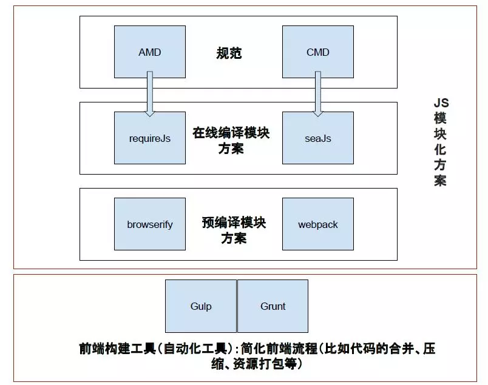

首先自我介绍，介绍自己过去的经历以及参与的项目以及项目中自己负责的部分以及使用的技术栈，面试官会对你说的技术栈和简历上的关键字来进行提问。也有可能是上来给你一套笔试题，然后再进行上面的步骤。提问完毕，一般会问你有啥需要问他的吗。

##基础问题：

###react 相关：

- 生命周期
- 父子间的通信
- 兄弟间的通信
- setSate 哈囊素的第二个参数的作用
- state 和 props
- 调用 setState 之后发生了什么？
- 虚拟 DOM 对于传统的 DOM 和 JS 的优势
- 性能优化
- MVVM 模式分析
- 路由部分 hash 和 history
- React-router redux 相关
- Dom diff 算法

###JS 相关：

- 闭包
- undefined 和 null 的区别
- 隐式类型转换
- 基本类型与引用类型
- 数据类型的判断(typeof ,instanceof, Object.prototype.toString.call() =>[object (String || Number ... )])
- 浅拷贝和深拷贝
- 引用传递 (引用类型作为参数传给函数，其值会被改变)
- 作用域链
- 对象的创建方法
- 对象的继承
- Class(理解，与上面的构造模式或者混合模式的函数对象有啥区别)
- Promise(理解；状态分为几个)
- async await (和 Promise 有啥区别)
- 事件的绑定与代理（发布/订阅模式）
- 同步和异步的区别

###CSS 相关：

- 两列布局，左侧固定右侧自适应(display:flex;左侧固定宽度，右侧 flex:1)
- 水平垂直同时居中(justify-content”center;align-items:center;)
- css3.0 的新特性

###其它：

- 跨域

  掘金文章： [https://juejin.im/post/5a2f92c65188253e2470f16d](https://juejin.im/post/5a2f92c65188253e2470f16d)

- 网页的性能优化

  1. css 压缩，尽量放到 head 里面
  2. 必要的 css 可以放到 style 标签里，可以加快首屏的渲染
  3. js 使用异步加载 添加标签 defer 或者 async
  4. js 压缩，放到 body底部
  5. 对必要的文件进行缓存，提高性能
  6. dom 树尽量不要太深，少于6层
  7. Css 减少内联样式，style 中也减少层数，尽量简洁，也方便以后覆盖样式

- 前端与后端之间的信息安全

  1. 使用 HTTPS 加密传输数据
  2. 对敏感信息使用加密算法前端进行加密后再传输

- Webpack 和 gulp 这类工程化工具

  1. gulp是任务，pipe 流（pipe）一步步的处理

  2. webpack 主要分四个快 entry, output, Module(对文件进行转换)，Plugins(对文件进行处理)

     ```js
     // 引入插件
     var gulp = require('gulp');
     // 引入文件，对文件内容进行处理，最后输入文件
     gulp.task('jade_mini',function(){
       gulp.src('client/templates/*.jade')
       .pipe(jade())
       .pipe(minify())
       .pipe(gulp.dest('build/minified_templates'));
     })
     `gulp jade_mini`
     ```

- 上面两者的区别

  首先可以从gulp和webpack的官网找到对它们的描述：

  gulp -> 用**自动化构建工具**增强你的工作流程

  Webpack -> Webpack是当下最热门的**前端资源模块化管理和打包工具**

  它们都属于前端构建工具，但gulp是任务管理工具（task runner），webpack是模块化打包工具（module bundler）。

  

## 题目：

###第一题:

```js
var a =3;
a.name = 'jsack'
// 问 a 此时的值；
// 还是 3, a 的类型是基本类型，这种添加对象属性无效
// 如果声明的是 对象，直接赋值基本类型，也不会成功
```

###第二题： 判断输出结果

```js
function test(
	console.log('1')
	setTimeout(()=>{
  	console.log('2')
	},300);
	new Promise(()=>{
  	console.log('3')
	});
)
test();
// 1
// 3
// 100ms 后输出 2
```

###第三题：交换两个参数的值

```js
var a =2,b=3;
// 不声明第三个参数，也不使用 JS 自带的方法实现 a b值互换
// 1
[b,a] = [a,b]
// 2 使用运算法则间接计算
a = a+b;
b = a - b;
a = a -b;
```

###第四题：数组去重

```js
var arr = [1,2,3,5,62,3,'a',2];
// 最快最简洁的方法
arr = Array.from(new Set(arr))
// filter
arr = arr.filter(function(element,index,self){
    return self.indexOf(element) === index;
 });
// 使用函数计算，方法很多
var new_arr = [];
for(var i =0;i<arr.length;i++){
    if(i == arr.indexOf(arr[i])){
        new_arr.push(arr[i])
    }
}
```